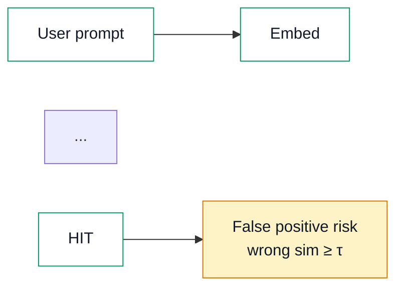

# Mermaid diagram style (Profile blog)

**Gold reference:** diagram **2** in [Day 11 — Semantic Caching vs Exact-Match Redis](series/ai-learning/day-11-semantic-caching-vs-exact-match-redis.html) (semantic hit / false-positive flow). Default theme nodes (green stroke, theme fill) plus a single `style` accent on the warning node.

**Theming docs:** [Mermaid theme configuration](https://mermaid.js.org/config/theming.html) — we use `theme: 'base'` with separate `themeVariables` for light and dark in `blog/assets/blog-diagrams.js`.

**Research (May 2026):** Three credible approaches surfaced: (1) Mermaid’s official guidance — only the `base` theme accepts `themeVariables`; set `darkMode: true` and explicit hex text/fill colors rather than relying on auto-derived contrast ([Mermaid theming docs](https://mermaid.js.org/config/theming.html)); (2) GitHub Primer’s semantic token matrix — separate light/dark values per role, near-black surfaces (not pure `#000`), accent fills that stay readable in both modes ([Primer color usage](https://primer.style/foundations/color/overview)); (3) per-node `classDef` for path roles plus minimal post-render JS for cream accent nodes only, avoiding global CSS `!important` overrides ([Mermaid flowchart styling](https://mermaid.js.org/syntax/flowchart.html#styling-and-classes)). **Chosen approach:** hybrid of (1)+(3) — `theme: 'base'` with light/dark `themeVariables`, standard `classDef` palette authored in light-mode hex, JS swaps classDefs on dark toggle, and post-render fixes `#111827` text only on `#fef3c7` accent nodes. Palette aligns with the blog’s existing green (`#059669`) / blue (`#2563eb`) / amber accent tokens and post `--code-bg` surfaces.

---

## Required pattern

1. **Flat flowchart** — `flowchart LR` or `flowchart TB`. No `subgraph` for simple parallel paths.
2. **`classDef` for multi-path comparisons** — explicit `fill`, `stroke`, and `color` on every class (light-mode values; JS swaps fills/text in dark mode).
3. **Single-path diagrams** — rely on `blog-diagrams.js` theme variables; use one inline `style Node fill:#fef3c7,stroke:#d97706,color:#111827` for accent nodes only (diagram 2 `FP`, diagram 3 `K`).
4. **Shared assets** — Mermaid CDN + `blog/assets/blog-diagrams.js` + `blog/assets/blog-diagrams.css`; wrap source in `<pre class="mermaid">`.
5. **`htmlLabels: false`** — SVG text labels only (set in `blog-diagrams.js`).

---

## Standard `classDef` (author in light-mode values)

```mermaid
classDef pipeline fill:#ffffff,stroke:#059669,color:#111827
classDef accent fill:#fef3c7,stroke:#d97706,color:#111827
classDef exact fill:#ecfdf5,stroke:#059669,color:#111827
classDef semantic fill:#f0f4ff,stroke:#2563eb,color:#111827
```

On dark mode toggle, `blog-diagrams.js` rewrites `pipeline` / `exact` / `semantic` to dark fills + light text before re-render. **`accent` and inline cream `style` nodes stay cream with `#111827` text in both themes.**

---

## Light mode colors

| Role | Fill | Stroke | Label |
|------|------|--------|-------|
| Default / pipeline node | `#ffffff` | `#059669` | `#111827` |
| Exact path (`exact`) | `#ecfdf5` | `#059669` | `#111827` |
| Semantic path (`semantic`) | `#f0f4ff` | `#2563eb` | `#111827` |
| Accent / Kafka / warning | `#fef3c7` | `#d97706` | `#111827` |
| Edges / arrows | — | `#059669` | — |
| Page / diagram box | post `--code-bg` | post `--line` | post `--text` |

**Mermaid `themeVariables` (light):** `primaryColor: '#ffffff'`, `primaryTextColor: '#111827'`, `lineColor: '#059669'`, `primaryBorderColor: '#059669'`.

---

## Dark mode colors

| Role | Fill | Stroke | Label |
|------|------|--------|-------|
| Default / pipeline node | `#1e3328` | `#059669` | `#ececea` |
| Exact path (`exact`) | `#1e3328` | `#059669` | `#ececea` |
| Semantic path (`semantic`) | `#1a2744` | `#2563eb` | `#ececea` |
| Accent / Kafka / warning | `#fef3c7` | `#d97706` | `#111827` |
| Edges / arrows | — | `#059669` | — |
| Page / diagram box | post `--code-bg` (dark gray) | post `--line` | post `--text` |

**Mermaid `themeVariables` (dark):** `primaryColor: '#1e3328'`, `primaryTextColor: '#ececea'`, `lineColor: '#059669'`, `primaryBorderColor: '#059669'`.

Post-render JS only forces `#111827` on **accent/cream** nodes (`#fef3c7` fill). All other label colors come from Mermaid theme + dark `classDef` swap.

---

## Diagram 1 (comparison — two classes)

```mermaid
classDef exact fill:#ecfdf5,stroke:#059669,color:#111827
classDef semantic fill:#f0f4ff,stroke:#2563eb,color:#111827
class P1,H1,R1,OUT1 exact
class P2,EMB,VEC,OUT2,MISS semantic
```

---

## Diagram 2 (gold — pipeline + accent)



`pipeline` class on default nodes; accent `FP` stays cream with dark text in both themes.

---

## Diagram 3 (pipeline + Kafka accent)

```mermaid
classDef pipeline fill:#ffffff,stroke:#059669,color:#111827
class IE,C,Z,SC,CH,P,G pipeline
style K fill:#fef3c7,stroke:#d97706,color:#111827
```

---

## Verify

Serve repo root, open the post, toggle `#theme-toggle`:

- **Light:** light/white node fills, green strokes, dark labels; cream accent with dark text.
- **Dark:** dark green/blue node fills, green strokes, greyish labels; cream accent with dark text.

---

## Avoid

- CSS `fill: #111827 !important` on all `.node text` (breaks dark mode)
- Forcing dark text on every node in both themes via JS post-render
- `fill:#ffffff` on all nodes without dark-mode swap (washes out in dark mode)
- `#a7f3d0` / `#93c5fd` mint/sky fills with theme-light label color
- White node labels on dark fills
- `htmlLabels: true`

---

## For agents / future posts

Use this section when drafting or editing any Profile blog post with Mermaid diagrams.

### Step-by-step

1. **Copy HTML shell** from the latest post in the same series (nav, theme toggle, Mermaid CDN + shared assets).
2. **Read this file** and [NEW-POST-CHECKLIST.md](NEW-POST-CHECKLIST.md) § Diagrams (required).
3. **Author diagrams** as flat flowcharts with `classDef` (see template below). Gold reference: Day 11 diagram 2.
4. **Register the post** in `scripts/verify-blog-diagrams.mjs` (`slug`, `path`, `diagrams` count, `requiredClassDefs`).
5. **Run** `node scripts/verify-blog-diagrams.mjs --slug <slug>` — must exit `0`.
6. **Visual pass:** serve repo root (`python3 -m http.server 8080`), open the post, toggle light/dark, confirm labels readable on every node.

### Required HTML head / body links

Adjust `../../` depth for your series folder (`blog/series/<series>/` → two levels up to `blog/assets/`).

```html
<!-- in <head> -->
<link rel="stylesheet" href="../../assets/blog-diagrams.css">

<!-- before </body>, after inline theme/post scripts -->
<script src="https://cdn.jsdelivr.net/npm/mermaid@10/dist/mermaid.min.js"></script>
<script src="../../assets/blog-diagrams.js"></script>
```

Do **not** add a second `mermaid.initialize()` — `blog-diagrams.js` owns init and re-render on theme toggle.

### Mermaid block template (copy)

**Comparison (two paths):**

```html
<pre class="mermaid">flowchart TB
  A[Left path node] --> B[Left outcome]
  C[Right path node] --> D[Right outcome]

  classDef exact fill:#ecfdf5,stroke:#059669,color:#111827
  classDef semantic fill:#f0f4ff,stroke:#2563eb,color:#111827
  class A,B exact
  class C,D semantic</pre>
```

**Pipeline + single accent (gold pattern):**

```html
<pre class="mermaid">flowchart LR
  Q[Input] --> P[Process]
  P --> OUT[Output]
  P --> WARN["Risk / Kafka / warning node"]

  classDef pipeline fill:#ffffff,stroke:#059669,color:#111827
  class Q,P,OUT pipeline
  style WARN fill:#fef3c7,stroke:#d97706,color:#111827</pre>
```

### Verify script

```bash
node scripts/verify-blog-diagrams.mjs              # all registered posts
node scripts/verify-blog-diagrams.mjs --slug day11 # one post
```

Checks: shared asset links, required `classDef` strings, diagram count, light/dark label contrast (Playwright). Requires `npm install` (playwright) from repo root.

### Cursor rule

Agents editing `blog/**/*.html` should also follow `.cursor/rules/blog-diagrams.mdc`.
