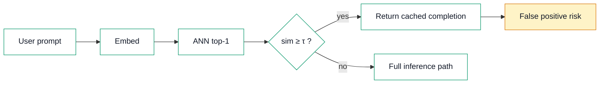
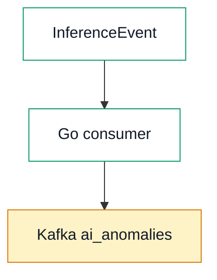
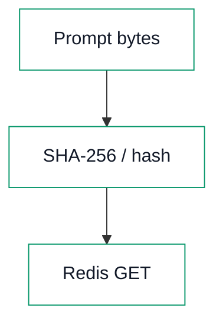

# Mermaid diagram style (Profile blog)

**Gold reference:** diagrams **2** and **3** in [Day 11 — Semantic Caching vs Exact-Match Redis](series/ai-learning/day-11-semantic-caching-vs-exact-match-redis.html) (semantic hit flow + LensAI Kafka bridge). Diagram **1** uses the same `classDef` rules with an extra `secondary` class for two-path comparisons.

This is the **only** Mermaid standard for new and updated posts.

---

## Required `classDef` pattern

Every flowchart must declare these classes (copy-paste as-is, then assign nodes with `class`):

```mermaid
classDef pipeline fill:#ffffff,stroke:#059669,color:#111827
classDef accent fill:#fef3c7,stroke:#d97706,color:#111827
```

| Class | Fill | Stroke | Label color |
|-------|------|--------|-------------|
| `pipeline` | `#ffffff` (white / light interior) | `#059669` (green) | `#111827` (black) |
| `accent` | `#fef3c7` (cream) | `#d97706` (amber) | `#111827` (black) |

**Two-path comparisons** (e.g. exact vs semantic) may add one extra class — never more than one accent + one alternate stroke:

```mermaid
classDef secondary fill:#f0f4ff,stroke:#2563eb,color:#111827
```

---

## Authoring rules

1. **Flat flowchart** — `flowchart LR` or `flowchart TB`. **No `subgraph`** for simple flows (cluster backgrounds break contrast on theme toggle).
2. **`classDef` + `class` only** — assign every styled node via `class id1,id2 pipeline`. **No per-node `style` spam** except migrating legacy posts; prefer `class FP accent` over `style FP fill:…`.
3. **Dark text only on nodes** — `color:#111827` or `color:#242424` in every `classDef`. **Never** `color:#fff`, `#ececea`, or theme greys on node labels.
4. **Accent sparingly** — one `accent` node per diagram when highlighting risk/Kafka/warnings (diagram 2 `FP`, diagram 3 `K`).
5. **Shared assets** — after Mermaid CDN, load `blog/assets/blog-diagrams.js` then `blog/assets/blog-diagrams.css`.
6. **Markup** — wrap source in `<pre class="mermaid">` inside `.prose`.

---

## Light and dark mode

Blog posts toggle theme with `#theme-toggle` (`data-theme="dark"` on `<html>`).

`blog-diagrams.js` enforces readability:

- **`flowchart: { htmlLabels: false }`** — SVG text labels so fill/stroke overrides apply.
- **Theme variables** — in **both** themes, default Mermaid node fills stay **light** (`#ffffff` / `#ecfdf5` / `#fef3c7`) with **green** borders (`#059669`). Dark page background does **not** flip nodes to dark fills.
- **Post-render override** — after `mermaid.run()`, every `.node` label is forced to `#111827` (or `#242424` from `classDef`) regardless of theme. Light-fill detection (luminance &gt; 0.55) catches `classDef` pastels and inline `style` fills.
- **Edges / loose SVG text** — arrow labels and non-node text follow page theme (`#242424` light, `#ececea` dark) where background is transparent.

**Verification:** serve repo root, open the post, toggle light/dark — all nodes must show **black/dark text on light interiors** and **green strokes** on pipeline nodes; accent nodes stay cream with amber stroke.

---

## Copy-paste template (new post)

```html
<link rel="stylesheet" href="../../assets/blog-diagrams.css">
```

Before `</body>`:

```html
<script src="https://cdn.jsdelivr.net/npm/mermaid@10/dist/mermaid.min.js"></script>
<script src="../../assets/blog-diagrams.js"></script>
```

Diagram block:

```html
<pre class="mermaid">flowchart LR
  A[Step one] --> B[Step two]
  B --> C[Highlight node]

  classDef pipeline fill:#ffffff,stroke:#059669,color:#111827
  classDef accent fill:#fef3c7,stroke:#d97706,color:#111827
  class A,B pipeline
  class C accent</pre>
```

---

## Gold examples (Day 11)

### Diagram 2 — single path + accent (`FP`)



### Diagram 3 — pipeline + Kafka accent



### Diagram 1 — comparison (`pipeline` + `secondary`)



---

## Avoid

- `subgraph` for styling parallel paths (use stacked chains + `classDef`).
- Per-node `style` on every node when `classDef` covers the group.
- White or light-grey **node** label colors (`#fff`, `#ececea`, `#f9fafb`).
- Bright mint/sky fills (`#a7f3d0`, `#93c5fd`) — use `#ffffff` / `#f0f4ff` and strokes `#059669` / `#2563eb`.
- `htmlLabels: true` — breaks dark-mode contrast.
- Dark node fills in dark mode — nodes stay light; only the **page** background darkens.

---

## Local check

```bash
python3 -m http.server 8080   # from repo root
```

Open the post → toggle `#theme-toggle` → confirm all diagrams: green stroke, light fill, **black** node text in both themes.
