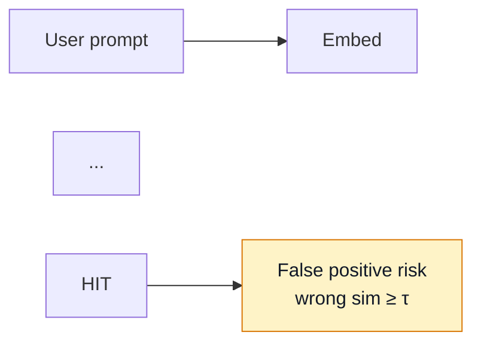

# Mermaid diagram style (Profile blog)

**Gold reference:** diagram **2** in [Day 11 — Semantic Caching vs Exact-Match Redis](series/ai-learning/day-11-semantic-caching-vs-exact-match-redis.html) (semantic hit / false-positive flow). Default theme nodes (green stroke, theme fill) plus a single `style` accent on the warning node.

---

## Required pattern

1. **Flat flowchart** — `flowchart LR` or `flowchart TB`. No `subgraph` for simple parallel paths.
2. **`classDef` for multi-path comparisons** — explicit `fill`, `stroke`, and **`color:#111827`** (dark text only) on every class. Never white or light-grey node labels.
3. **Single-path diagrams** — rely on `blog-diagrams.js` theme variables; use one inline `style Node fill:#fef3c7,stroke:#d97706,color:#111827` for accent nodes only (diagram 2 `FP`, diagram 3 `K`).
4. **Shared assets** — Mermaid CDN + `blog/assets/blog-diagrams.js` + `blog/assets/blog-diagrams.css`; wrap source in `<pre class="mermaid">`.

---

## Diagram 1 (comparison — two classes)

```mermaid
classDef exact fill:#ecfdf5,stroke:#059669,color:#111827
classDef semantic fill:#f0f4ff,stroke:#2563eb,color:#111827
class P1,H1,R1,OUT1 exact
class P2,EMB,VEC,OUT2,MISS semantic
```

| Class | Fill | Stroke | Label |
|-------|------|--------|-------|
| `exact` | `#ecfdf5` | `#059669` | `#111827` |
| `semantic` | `#f0f4ff` | `#2563eb` | `#111827` |

---

## Diagram 2 (gold — theme + accent)



Dark mode: theme `primaryColor` `#1e3328`, light labels on dark nodes; accent `FP` stays cream with `#111827` text.

---

## Light and dark mode (`blog-diagrams.js`)

- `flowchart: { htmlLabels: false }`
- Theme-aware default nodes: light `#ecfdf5` (light page) / dark `#1e3328` (dark page), green stroke `#059669`
- Post-render: luminance on node shapes — light fills → `#111827`; dark fills → page light/dark text. Never `#fff` on pastel nodes.
- `classDef` light fills (`#ecfdf5`, `#f0f4ff`, `#fef3c7`) keep `#111827` in **both** themes

**Verify:** serve repo root, open post, toggle `#theme-toggle` — diagram 1 readable; diagrams 2–3 unchanged.

---

## Avoid

- `fill:#ffffff` on all nodes (washes out dark mode)
- `#a7f3d0` / `#93c5fd` mint/sky fills with theme-light label color
- White node labels (`#fff`, `#ececea`)
- `htmlLabels: true`
- Applying `classDef pipeline` to diagram 2/3 when theme defaults already match the gold reference
