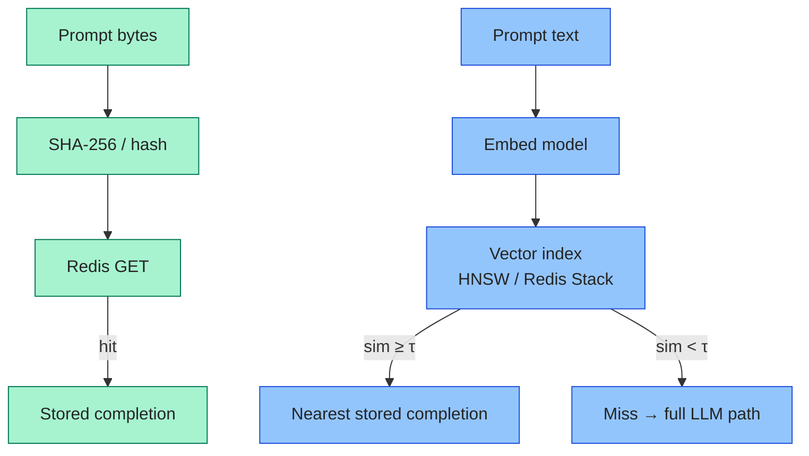
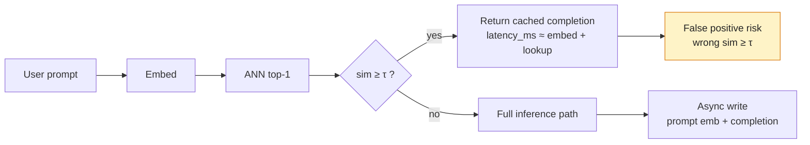

# Mermaid diagram style (Profile blog)

Gold reference: **diagram 2** in [Day 11 — Semantic Caching vs Exact-Match Redis](series/ai-learning/day-11-semantic-caching-vs-exact-match-redis.html) (semantic hit / false-positive flow under “Semantic cache — embeddings as keys”).

## Required pattern

1. **Flat flowchart** — prefer `flowchart LR` or `flowchart TB` without `subgraph`. Subgraph cluster backgrounds fight theme switching and label contrast.
2. **`classDef` for colored nodes** — explicit `fill`, `stroke`, and `color:#242424` on every class you assign. Apply with `class id1,id2 myClass`.
3. **Accent nodes only when needed** — single-path diagrams may use one inline `style Node fill:…,stroke:…,color:#242424` (see diagram 2 `FP` node). Multi-path comparisons use `classDef` groups instead of per-node `style` lines or subgraph styling.
4. **Shared JS** — load `blog/assets/blog-diagrams.js` after Mermaid CDN. It sets `flowchart: { htmlLabels: false }`, theme-aware `themeVariables`, and luminance-based label overrides on theme toggle.
5. **Shared CSS** — `blog/assets/blog-diagrams.css` wraps `<pre class="mermaid">` blocks.

## Example (comparison — diagram 1, same post)

## Example (single path + warning — diagram 2)

## Avoid

- `subgraph` for styling two parallel paths (use stacked chains + `classDef`).
- Per-node `style` on every node when `classDef` covers the group.
- `color:#111827` or other hard-coded dark text without the shared JS overrides.
- HTML labels (`htmlLabels: true`) — breaks dark-mode contrast.

## Local check

Serve repo root, open the post, toggle light/dark on `#theme-toggle`, confirm all three diagrams stay readable.
